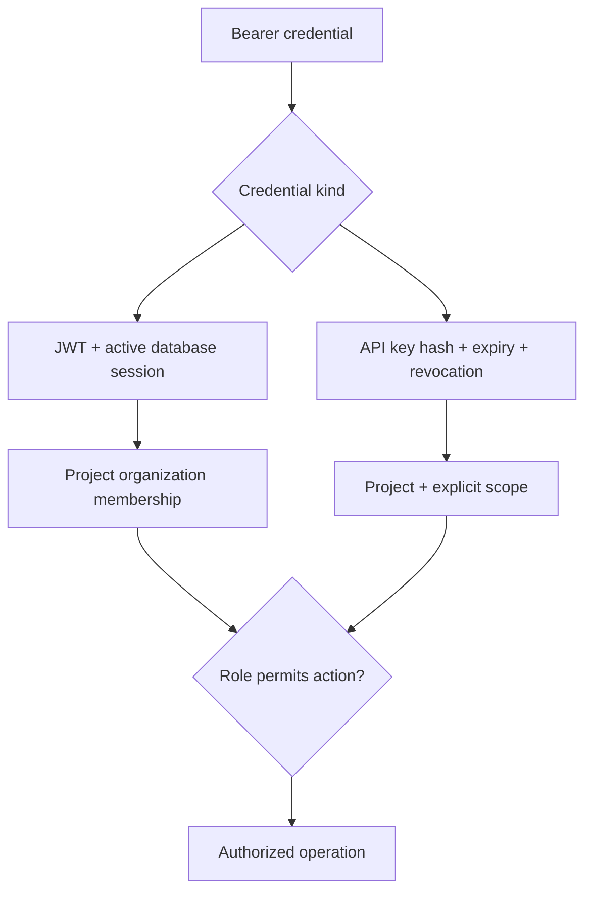
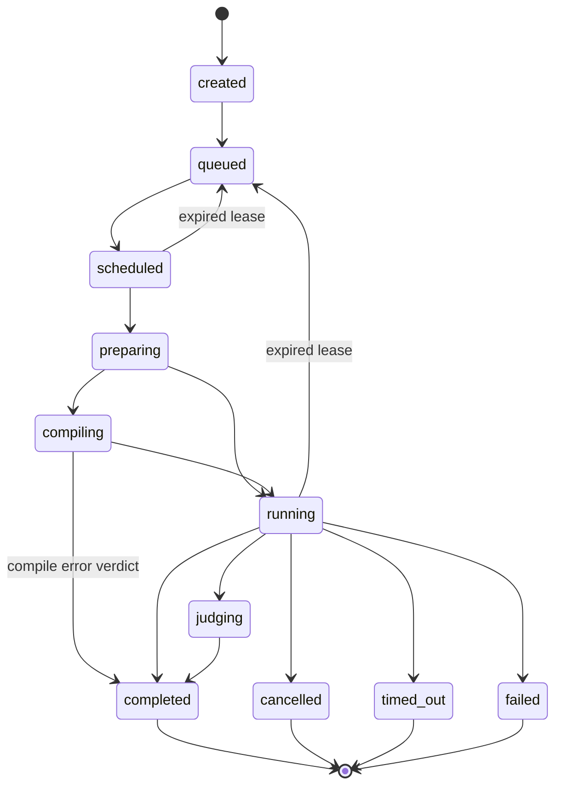
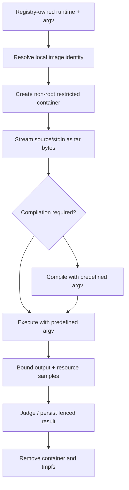
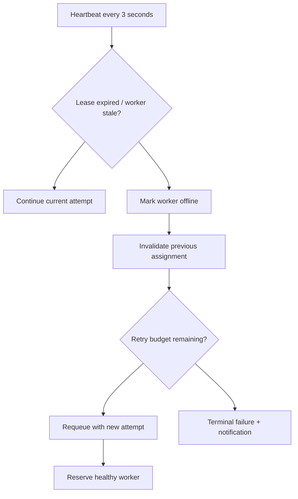
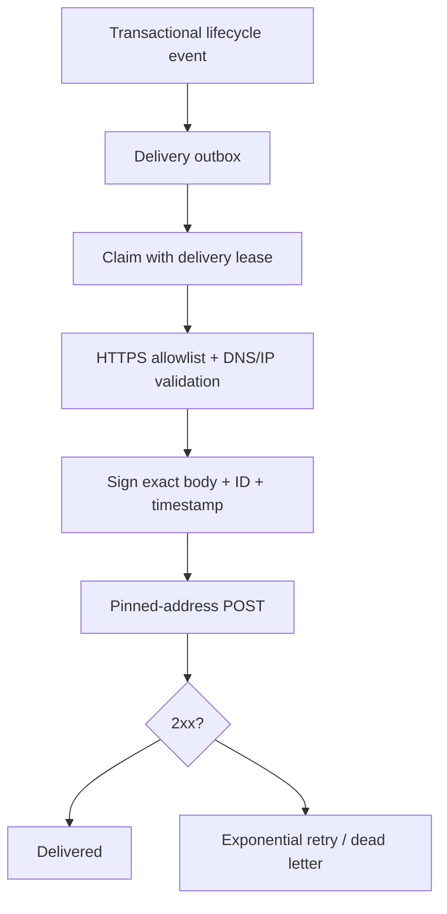

# CodeArena architecture

## Admission and tenancy

Authentication produces either a session actor or a scoped project-key actor. User memberships resolve organization roles. Viewer requests cannot create submissions; API keys must match both project and scope. API-key management requires a user with owner/admin membership. Global worker drain additionally requires PLATFORM_ADMIN_IDS.

Submission creation locks the project row, checks daily/outstanding quotas and runtime policy, inserts source and limits, then writes created/queued events in one transaction. PostgreSQL remains authoritative for admission; there are no separately maintained quota counters that can drift. Large-project count queries will eventually need partitioning or transactional usage aggregates.

## Scheduling

The scheduler serializes capacity reservations through a transaction advisory lock. It ages priority classes using a bounded 90-second advantage, preventing high-priority requests from bypassing arbitrarily old low-priority requests. It selects a healthy runtime-compatible worker by active/slots ratio. A reservation increments attempt and inserts an outbox row atomically; a deterministic BullMQ job ID deduplicates dispatch. Old delivered attempts cannot write current results.

The domain module contains the complete transition table, including cancellation/recovery from other active states. This diagram emphasizes common paths.

## Runtime execution

Each test receives a fresh container and workspace. The adapter accepts no user-selected images, shell options, paths, or environment variables. Source and stdin are tar bytes streamed into a fixed non-root tar process in the private tmpfs; only predefined registry argv is shell-quoted to attach stdin. NetworkMode=none and NetworkDisabled isolate runtime network namespaces, including platform services and metadata addresses. A read-only image plus tmpfs limits writable storage without host bind mounts.

ExecutionBackend is the replaceable boundary for future gVisor, Kubernetes jobs, microVM, and remote worker implementations. Those alternatives are not implemented.

## Worker recovery

The stale threshold is 15 seconds; active leases renew to 20 seconds. A worker database identity lock prevents two live worker instances with one ID. Loss of identity stops successful heartbeats and aborts local jobs. Finalization locks the submission and checks worker plus attempt; stale attempts cannot duplicate results or usage. Execution retries are at most three assignments. Startup/shutdown reap managed containers for that worker; disconnected hosts also need an external janitor before recycling worker IDs.

## Realtime and backpressure

Workers coalesce bounded chunks and append Redis Streams records. The API reads with blocking XREAD and exposes SSE, supporting Last-Event-ID replay. Output streams expire after one hour; persisted result and timeline survive expiration. SSE connections are capped per project and honor response backpressure. Database polling is not the primary realtime transport. Browser reconnect/replay needs further hardening before a high-availability launch.

## Webhook delivery

Secrets are AES-256-GCM encrypted at rest. Delivery attempts are bounded at eight. The recipient deduplicates event IDs; network delivery is at least once. Redirects are not followed, DNS is checked and pinned, and nonpublic destinations fail closed. Mail and webhook delivery run in the dedicated delivery-worker process, independently health-checked and scraped by Prometheus. The scheduler remains focused on worker recovery, capacity reservation, and dispatch, so slow SMTP/DNS/webhook I/O cannot stretch scheduling ticks.

## Control-plane observability

Submission admission persists the API request ID as a bounded `correlation_id`. Structured logs from the API, scheduler, and worker include that value when a submission is involved, allowing one request to be traced across admission, scheduling, recovery, and execution.

Administrative queue/fleet updates use a bounded Redis Stream (`control:events`) for low-latency delivery. The owner/admin SSE endpoint begins with PostgreSQL queue and fleet snapshots, filters tenant queue events server-side, and supports `Last-Event-ID` replay. Redis remains a transport optimization rather than a source of truth; reconnects recover from PostgreSQL even after stream expiry.
