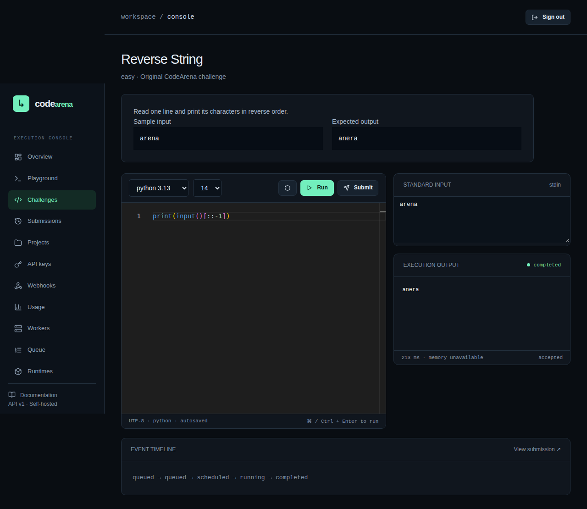
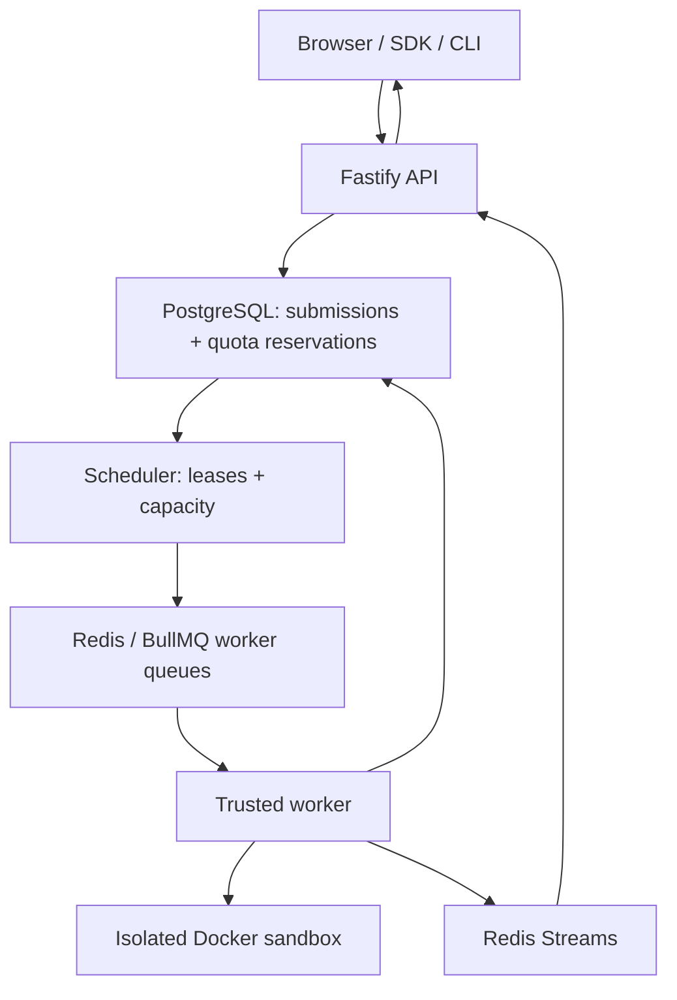

# CodeArena

**Run untrusted code. Safely. At scale.**

A self-hosted execution platform with a separate API, scheduler, and trusted Docker workers. CodeArena stores a traceable submission lifecycle, reserves project quotas transactionally, streams bounded output, judges protected tests, and signs result notifications.

The dark-first console includes a landing page, Monaco playground, challenge workspaces, submission details, and API-backed project/usage/queue/runtime views.



Captured by the Chromium E2E against the real API, queue, worker and Docker sandbox.

## Implementation status

This is an implementation of the execution and judging foundation, not a certification of production safety. Unit tests, lint, TypeScript checking, and production builds can run without Docker. The Docker integration, sandbox regression, and full browser execution tests **must pass on your intended Linux host before accepting external submissions**. CI has passed 82 tests, including all eight language runtimes, real sandbox boundaries, browser execution, two-worker crash recovery and Redis reconnect recovery. A separate full Compose smoke check validates startup/readiness, including the pinned MinIO source build. See [verification](docs/VERIFICATION.md) for exact runs and remaining gaps.

Working code includes registration/login and Argon2id passwords; rotating hashed refresh tokens; verification/reset mail outbox; tenant memberships and projects; hashed scoped API keys; eight centrally configured runtime definitions; bounded submissions and batches; transactional quotas; scheduler leases and outbox dispatch; independently constrained execution containers; cancellation; weighted test judging; hidden-output suppression; drafts/history; SSE output replay; encrypted webhook signing secrets and retry delivery; TypeScript SDK/CLI; metrics and dashboards.

Interview collaboration, education, advanced analytics, full administrative UI, and challenge leaderboards remain on the explicit [roadmap](docs/ROADMAP.md). MinIO now backs authorized immutable compilation-log artifacts and compiled-output caching for supported single-output toolchains. Java cache snapshots remain intentionally disabled until multi-file class output is captured safely. Pages display real API data, with honest empty/error states.

## Architecture



The database queue is the durable admission record; the scheduler dispatches through BullMQ using a transactional outbox. A Redis failure cannot lose an accepted submission. Untrusted source never runs in the API or scheduler. The trusted worker communicates with Docker; runtime containers have no socket, platform credentials, host mounts, or external networking.

## Stack

Next.js / React / TypeScript / Tailwind / Monaco; Fastify; PostgreSQL with SQL migrations; Redis and BullMQ; Docker Engine via Dockerode; Prometheus, Grafana, Caddy, Mailpit, and MinIO in development. SQL is parameterized; relational entities use foreign keys and indexes. JSON is used for execution limits, event metadata, and immutable webhook envelopes.

## Quick start

Requires Linux Docker Engine with working seccomp, memory/CPU/PID cgroups, Docker Compose v2, Node 22+, and pnpm 10.11.0. A trusted isolated worker host is recommended for hostile workloads. Do not deploy the development secrets publicly.

```bash
cp .env.example .env
# Edit .env: random JWT_SECRET, WEBHOOK_ENCRYPTION_KEY, database/storage/Grafana passwords.
corepack enable
pnpm install --frozen-lockfile
pnpm runtimes:build
# Optionally set DEMO_PASSWORD in .env before starting.
docker compose up -d --build --wait
```

Open http://localhost:3000. API: http://localhost:4000. Development mail: http://localhost:8025. Grafana: http://localhost:3001. Caddy: http://localhost:8080 (set WEB_ORIGIN and NEXT_PUBLIC_API_URL to this origin and rebuild to use it).

Register your own account, or use `demo@codearena.local` if you explicitly set `DEMO_PASSWORD`. Migrations and eight original sample challenges seed automatically. Workers advertise only runtime images actually present on their Docker daemon.

For source development, start PostgreSQL/Redis and mail services, then load `.env` in your shell:

```bash
docker compose up -d postgres redis minio mailpit
set -a; . ./.env; set +a
pnpm db:migrate
pnpm db:seed
pnpm dev
```

Scripts: `pnpm test`, `pnpm lint`, `pnpm typecheck`, `pnpm build`, `pnpm test:integration`, `pnpm test:security`, `pnpm test:e2e`.

## API example

Create an API key in the console. Keys are shown once and stored as SHA-256 hashes. The execution API currently requires an explicit project UUID and runtime version.

```bash
curl -X POST http://localhost:4000/v1/submissions \
  -H "Authorization: Bearer $CODEARENA_API_KEY" \
  -H 'Content-Type: application/json' \
  -d '{"projectId":"YOUR_PROJECT_UUID","language":"python","version":"3.13","source":"print(input())","stdin":"hello","limits":{"wallTimeMs":3000}}'

curl http://localhost:4000/v1/submissions/SUBMISSION_UUID \
  -H "Authorization: Bearer $CODEARENA_API_KEY"

curl -N http://localhost:4000/v1/submissions/SUBMISSION_UUID/events \
  -H "Authorization: Bearer $CODEARENA_API_KEY"
```

API acceptance is `202 {id,status:"queued"}`. Batch creation caps at ten items and returns per-item outcomes (`207`), rather than claiming whole-batch atomicity.

```ts
import { CodeArena } from "@codearena/execution-sdk";
const arena = new CodeArena({ apiKey: process.env.CODEARENA_API_KEY! });
const submission = await arena.submissions.create({
  projectId: process.env.CODEARENA_PROJECT_ID!,
  language: "python",
  version: "3.13",
  source: "print('hello')",
});
const result = await arena.submissions.wait(submission.id);
```

Build the SDK with `pnpm --dir packages/execution-sdk build`, then use its CLI binary or `node packages/execution-sdk/dist/cli.js run main.py`. Configuration uses environment variables or a mode-0600 config file; secrets are never command-line arguments.

## Limits and execution lifecycle

`created → queued → scheduled → preparing → compiling (when needed) → running → judging (challenges) → completed`. Terminal alternatives: `failed`, `cancelled`, `timed_out`. Compilation errors end with a persisted `compilation_error` verdict. Every transition stores timing, reason, attempt fencing, and worker identity when applicable.

Hard maximums: 10,000 CPU ms, 15,000 wall ms per sandbox, 512 MiB memory, 64 processes, 1,024 KiB combined output, and 32,768 KiB writable workspace. Defaults are lower. A challenge test may reduce wall/memory limits; it cannot raise caller or platform limits. Total challenge execution is capped separately. Compiled outputs for TypeScript, C, C++, Go, and Rust may be restored from an integrity-checked immutable object cache keyed by source and captured runtime definition. Each restore still lands only in that test's private tmpfs; there is no shared writable build directory. Cache misses compile inside the sandbox and may populate object storage.

Docker limits memory/PIDs/CPU scheduling/filesystem. A worker deadline kills wall-time abuse. CPU time uses both process rlimits and aggregate cgroup sampling; short executions can report zero CPU/memory because measurement is sampled. Do not treat these values as exact billing measurements. See [SECURITY.md](SECURITY.md).

## Documentation

- [Architecture](ARCHITECTURE.md)
- [Security and threat model](SECURITY.md)
- [API, authentication, errors, webhooks, SDK, CLI](docs/API.md)
- [Self-hosting and worker operations](docs/OPERATIONS.md)
- [Verification and acceptance gaps](docs/VERIFICATION.md)
- [Roadmap](docs/ROADMAP.md)
- [Contributing](CONTRIBUTING.md)

Licensed under MIT.
